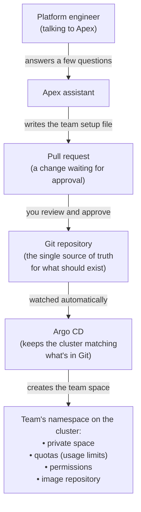

# Onboard a Team

**Who this is for:** platform engineers — the people who run the platform for everyone else.

**In one sentence:** onboarding a team gives a group of developers their own private,
walled-off space on the platform so they can start building services.

---

## Why you do this

Before a team can ship anything, they need a place to put it. Onboarding creates that place
in one step. It's the platform's **front door** for a new team — nothing else can happen for
them until this is done.

When you onboard a team, four things get created for them automatically:

| What gets created | What it means in plain English |
|---|---|
| A **namespace** | A private folder inside the cluster where only this team's things live, kept separate from every other team. (A *cluster* is the group of computers that run everyone's software. A *namespace* is a labelled section of it.) |
| **Quotas** | A spending limit — the most computing power (CPU and memory) and the most running programs the team is allowed to use, so one team can't accidentally hog everything. |
| **Permissions** | Who is allowed to see the team's stuff. This is linked to the login group the team already uses, so people get access automatically. |
| An **image repository** | A storage locker for the team's built software, ready to be deployed. (An *image* is a packaged-up copy of an application, ready to run. The *repository* is where those packages are kept.) |

You do **not** set any of this up by hand. You answer a few questions, and Apex writes it all
for you.

---

## What you need before you start

- You are running Apex as the **platform engineer** version (started with `apex-manager`).
- You know two things about the team:
    1. **A short name** for the team, in lowercase with dashes — for example `payments-team`.
       This becomes the name of their private space.
    2. **Their login group** — the name of the group these developers already use to sign in
       to your company's systems. If you don't know it, ask whoever manages logins. Don't
       guess it.

Everything else has sensible defaults you can accept.

---

## How it works, step by step

Onboarding is a short conversation followed by a review. Here is the whole thing:

### Step 1 — Apex asks you a few questions

It asks for:

- **The team name** (e.g. `payments-team`).
- **The login group** (see above).
- **Quotas** — how much computing power the team can use. You can just accept the defaults;
  they suit most teams and can be changed later.

### Step 2 — Apex writes the setup and checks it

Apex fills in a small setup file for the team and runs it through an automatic **safety
check** (a set of rules that catches mistakes and unsafe settings before anything is
created). You don't do anything here — it happens on its own.

### Step 3 — Apex opens a pull request for you to review

Apex creates a **pull request** — a proposed change that someone reviews and approves before
it takes effect. Think of it as a "please approve this" note with the exact changes attached.
Nothing is created on the platform until this is approved and merged.

You review it, and when it looks right, you approve it (merge it).

### Step 4 — The team's space is created automatically

Once you approve, the platform builds the team's namespace, quotas, permissions, and image
repository on its own — no manual steps. From this moment the team is live and can create
their first service.

### Step 5 — Apex hands back

Apex gives you the link to what was created and points you to the next step: the team
scaffolding their first service.

---

## What the team can do afterwards

As soon as onboarding is approved, the team can create their first service (this is a
separate feature called **scaffold a service**). They land in their own namespace, with their
own storage and their own limits, completely separated from other teams.

---

## Good to know

- **One team at a time.** Each team gets its own separate setup. Apex won't bundle several
  teams into one request — this keeps each team's history clean and easy to follow.
- **Nothing is locked in.** Worried about picking the wrong quota? Don't be. Changing a
  team's limits later is just another small, reviewed change — not a rebuild.
- **You can't skip the review.** Every change goes through the approve-first step. This is on
  purpose: it means there's always a record of who approved what.

---

## The technology behind it

You don't need to understand this section to onboard a team — it's here for the curious.

Here is what actually happens from your request to a live team space:

**The words in that diagram, explained:**

- **Git repository** — a shared, version-tracked folder that holds the written definition of
  everything the platform should contain. It is the single, trusted record: if it's not in
  here, it doesn't exist on the platform.
- **Argo CD** — a tool that constantly watches that Git repository and makes the real
  platform match it. When your approved change lands in Git, Argo CD notices and creates the
  team's space to match — automatically. This approach (describe what you want in Git, let a
  tool make it real) is called **GitOps**.
- **Cluster / namespace** — as above: the cluster is the pool of computers running everyone's
  software; the namespace is this team's private, labelled section of it.

The key idea: **you never touch the live system directly.** You approve a written change, and
an automated tool applies it for you. That's what makes onboarding safe, repeatable, and easy
to audit.
